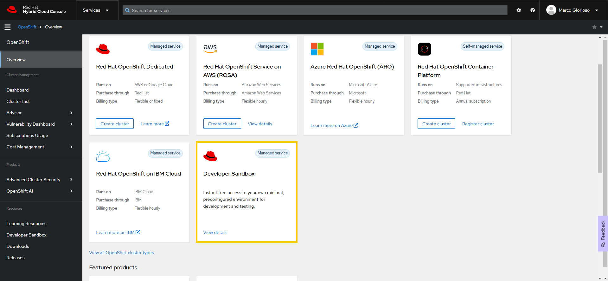
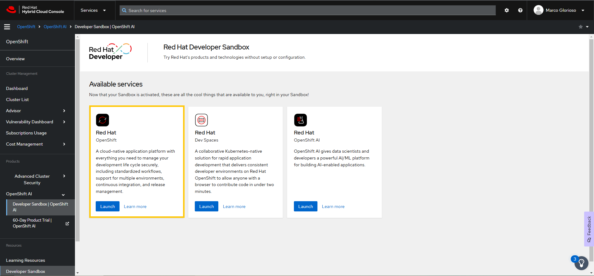

# OpenShift con Developer Sandbox Red Hat - Curso CKA

## Descripción
Este repositorio contiene un laboratorio diseñado para aprender a trabajar con OpenShift utilizando la **Developer Sandbox gratuita de Red Hat**. Exploraremos conceptos avanzados como despliegues de aplicaciones, resolución de problemas en Pods, y estrategias de despliegue como **Blue-Green** y **Canary**.

## Prerrequisitos
- **Registro en la Sandbox de Red Hat OpenShift**:
   - Regístrate en la [Sandbox de OpenShift](https://sso.redhat.com/auth/realms/redhat-external/protocol/openid-connect/auth?client_id=cloud-services&redirect_uri=https%3A%2F%2Fconsole.redhat.com%2Fopenshift%2Foverview&response_type=code&scope=openid&nonce=acf49cfd-a545-433c-a231-6ead21cda073&state=91ea2b9791534a93b455cb4c1db5329e&response_mode=fragment).
   - Accede a tu cuenta personal y asegúrate de tener un entorno funcional.
- **Herramientas necesarias**:
   - CLI de OpenShift (`oc`), ya preinstalada en la Sandbox.
   - Navegador web para interactuar con la consola gráfica de OpenShift.
- **Conocimientos previos**:
   - Kubernetes (pods, servicios, manifiestos YAML).
   - Docker y estrategias de contenedores.

## Objetivos
- Aprender a utilizar la Sandbox de OpenShift proporcionada por Red Hat.
- Realizar configuraciones avanzadas, como rutas, servicios e ingress.
- Implementar estrategias de despliegue Blue-Green y Canary.
- Utilizar herramientas de resolución de problemas en Pods.
- Desplegar aplicaciones desde repositorios Git y manifiestos YAML.

## Paso 1: Acceso a la Sandbox
- Dirígete a la [Overview console de Red Hat](https://console.redhat.com/openshift/overview)
- Usa las credenciales de tu cuenta Red Hat para iniciar sesión.
- Una vez dentro, dirigete a *Developer Sandbox*




- Una vez dentro de la Developer Sandbox, podras utilizar las funcionalidades gráfica para crear los recursos o el terminal en la esquina superior derecha para ejecutar los comandos.


## Paso 2: Crear un nuevo proyecto (namespace)
- Configura tu entorno de trabajo con el siguiente comando:
  ```bash
  oc project <nombre-del-proyecto>
  ```
  > Este comando establece el namespace o proyecto en el cual trabajarás.

## Lab 1: Despliegue de Aplicaciones

Desplegar una aplicación desde un repositorio Git local:

1. Clona el repositorio de ejemplo:
  ```bash
  git clone https://github.com/openshift/source-to-image.git
  cd source-to-image/examples/nginx-centos7
  ```
  > Aquí clonamos el repositorio localmente y navegamos hasta la carpeta con la aplicación.

2. Crear un nuevo BuildConfig basado en Docker:
  ```bash
  oc new-build --name s2i-nginx --binary --strategy docker
  ```
  > `oc new-build` crea un objeto `BuildConfig` para construir una imagen Docker a partir de la fuente local especificada. Este es un objecto clave para automatizar y gestionar la integración continua en OpenShift.

   El objeto **BuildConfig** en OpenShift es una definición que describe cómo construir una aplicación en la plataforma. Específicamente, define:

   - **Origen del código fuente**: De dónde obtener el código (repositorios Git, etc.).
   - **Estrategia de construcción**: Cómo construir la aplicación (Docker, S2I - Source-to-Image, etc.).
   - **Desencadenantes de construcción**: Eventos que inician una nueva construcción (cambios en el código fuente, actualizaciones de imágenes base, activaciones manuales).
   - **Configuración del entorno**: Variables, recursos y opciones necesarias para el proceso de construcción.

   Puedes ver el objeto **BuildConfig** recién creado en el menú de la derecha, en la sección **Builds**. Allí encontrarás un objeto llamado **s2i-nginx**. En la sección **YAML**, podrás visualizar un manifiesto YAML del tipo **BuildConfig**, correspondiente a la API `build.openshift.io/v1`.

3. Inicia el proceso de construcción:
  ```bash
  oc start-build s2i-nginx --from-dir=.
  ```
  > `oc start-build` inicia la construcción con el contenido local. Este comando tomará los archivos presentes en el directorio actual para construir la imagen.

El comando fallará debido a la ausencia de un archivo de configuración necesario para la imagen Docker en el proyecto de OpenShift. Sin embargo, no te preocupes: este paso se utilizó solo para demostrar cómo es posible construir una imagen Docker a partir de un **BuildConfig** en OpenShift.

## Lab 2: Importar e Instalar Aplicaciones

1. Importar la imagen de Python desde el registro de Red Hat:
  ```bash
  oc import-image rhel9/python-39:9.5-1730569177 --from=registry.redhat.io/rhel9/python-39:9.5-1730569177 --confirm
  ```
  > Este comando importa una imagen Docker del registro de Red Hat al registro local de OpenShift.

  Puedes ver el objeto **ImageStream** recién descargado en el menú lateral derecho, en modo **Administrador**, dentro de la sección **ImageStream**. Allí encontrarás un objeto llamado **python-39**. En la sección **YAML**, podrás visualizar un manifiesto YAML del tipo **ImageStream**, correspondiente a la API `image.openshift.io/v1`. Más abajo, encontrarás todos los detalles relacionados con la imagen Docker descargada.

2. Crear una nueva aplicación desde la imagen:
  ```bash
  oc new-app --image-stream="<nombre-del-proyecto>/python-39:9.5-1730569177"
  ```
  > `oc new-app` crea una nueva aplicación en OpenShift, utilizando el flujo de imagen importado.

  Deberías ver el siguiente resultado en la línea de comandos:

  

  Puedes ver la aplicación desplegada en el menú lateral derecho, en modo **Developer**, dentro de la sección **Topology**. Allí encontrarás un objeto llamado **python-39**. Sin embargo, lamentablemente este despliegue fallará nuevamente debido a un error en los pods, que estarán en estado **CrashLoopBackOff**.

## Lab 3: Resolución de Problemas en Pods (CrashLoopBackOff)

En Kubernetes, una limitación común es que no se puede acceder directamente a un pod cuando está en estado **CrashLoopBackOff**. Sin embargo, en entornos OpenShift, puedes utilizar el comando `oc debug` para solucionar este problema creando una copia temporal del pod que está fallando. Esto te permite analizar la causa del error de manera efectiva en un entorno controlado.

```bash
oc debug deployment/python-39
```
> Este comando permite ejecutar una sesión de depuración, creando una copia del contenedor del despliegue, pero con acceso interactivo.

## Lab 4: Despliegue Blue-Green

1. Crear una instancia de la aplicación con una plantilla:
  ```bash
  oc new-app --template=openshift/nginx-example --name=my-nginx-example-v1 --param=NAME=my-nginx-example-v1
  ```
  > `oc new-app` genera un despliegue a partir de la plantilla `nginx-example`, con el nombre especificado.

  **¿Qué es un template en este contexto Openshift?**
  Un template en OpenShift es un archivo YAML o JSON que define una serie de recursos de Kubernetes/OpenShift (como pods, servicios o configuraciones de build) junto con parámetros que pueden ser personalizados en el momento de la creación. Esto permite desplegar aplicaciones complejas de forma repetible y con diferentes configuraciones. Puedes pensarlo con un Chart Helm. 

  Para visualizar la definición del template, utiliza el siguiente comando:  
  ```bash
  oc get template nginx-example -n openshift -o yaml
  ```

  Puedes ver la aplicación desplegada en el menú lateral derecho, en modo **Developer**, dentro de la sección **Topology**. Allí encontrarás un objeto llamado **my-nginx-example-v1**. 

2. Probar la aplicación en el navegador:

   Dentro de la sección **Topology**, al hacer clic en el círculo de la aplicación, se abrirá un menú en el lado derecho. Desplázate hacia abajo hasta la sección **Routes**. Copia y pega la ruta proporcionada en tu navegador para visualizar la aplicación desplegada.

   > La URL de la aplicación se genera automáticamente mediante una ruta definida en OpenShift.

3. Probar con una llamada `curl`:
  ```bash
  curl -sS -D - $(oc get route my-nginx-example-v1 -o jsonpath='{.spec.host}') -o /dev/null | grep server
  ```
  > Utiliza `curl` para hacer una solicitud HTTP a la aplicación y muestra información del servidor.

4. Desplegar una segunda versión de la aplicación (Blue-Green):
  ```bash
  oc new-app --template=openshift/nginx-example --name=my-nginx-example-v2 --param=NAME=my-nginx-example-v2 --param=NGINX_VERSION=1.22-ubi8
  ```
  > Despliega una nueva aplicación con una versión diferente de NGINX.

5. Implementar el cambio de rutas:

   Antes de realizar el cambio de ruta, resulta interesante visualizar ambas rutas en la página web. Puedes ver los objetos **Routes**, creados automáticamente por OpenShift, en el menú lateral derecho, en modo **Administrador**, dentro de la sección **Networking**. Allí encontrarás dos objetos de rutas que apuntan a dos servicios diferentes, correspondientes a las dos aplicaciones desplegadas con versiones distintas.

  ```bash
  oc patch route/my-nginx-example-v1 -p '{"spec": {"to": {"name": "my-nginx-example-v2" }}}'
  ```
  > `oc patch` permite actualizar las rutas para redirigir el tráfico al nuevo SVC `my-nginx-example-v2`.

  Deberías ver el cambio reflejado en la página web.

  

6. Verificación:
  ```bash
  curl -sS -D - $(oc get route my-nginx-example-v1 -o jsonpath='{.spec.host}') -o /dev/null | grep server
  ```
  > Utiliza `curl` para confirmar que la nueva versión del servidor está activa.

## Lab 5: Traffic shifting or Despliegue Canary

1. Editar la ruta para definir el balanceo de tráfico:
  ```bash
  oc edit route my-nginx-example-v1
  ```
  > Edita la ruta para establecer los pesos de balanceo entre las dos versiones.

2. Definir configuración de balanceo en el YAML:
  ```yaml
  # Deja el campo **host** sin cambios.
  spec: 
    to:
      kind: Service
      name: my-nginx-example-v1
      weight: 50
    alternateBackends:
    - kind: Service
      name: my-nginx-example-v2
      weight: 50
    wildcardPolicy: None
  ```
  > Define un peso igual entre ambas versiones para un despliegue Canary.

3. Verificación:
  ```bash
  for i in $(seq 1 6); do curl -sS -D - $(oc get route my-nginx-example-v1 -o jsonpath='{.spec.host}') -o /dev/null | grep server; done
  ```
  > Ejecuta varias solicitudes para confirmar que ambas versiones reciben el tráfico esperado.

## Lab 6: Despliegue de la Aplicación Bookinfo
- Desplegar la aplicación Bookinfo desde un manifiesto YAML.
- Crear rutas e ingress para exponer los servicios.

### Paso 1: Desplegar la aplicación Bookinfo
1. Utiliza el manifiesto de Bookinfo disponible en este enlace:
   - [YAML Bookinfo](https://github.com/istio/istio/blob/master/samples/bookinfo/platform/kube/bookinfo.yaml)

2. Copia el contenido del archivo YAML y realiza el despliegue desde el menú lateral derecho, en modo **Developer**, dentro de la sección **+ Add**.

   

3. Una vez desplegado, en el menú lateral derecho, en modo **Developer**, dentro de la sección **Topology**, podrás visualizar los diferentes componentes de la aplicación **Bookinfo** desplegados en el clúster de OpenShift.

   

### Paso 2: Crear una Route

1. Dirígete al menú lateral derecho, en modo **Administrador**, dentro de la sección **Networking** > **Routes**.
2. Haz clic en el botón **Create Route**, lo que abrirá un formulario para definir una nueva ruta.

   

3. Una vez creada la ruta, OpenShift generará automáticamente una **location** para la ruta hacia el exterior. Copia y guarda este valor, ya que lo necesitarás en el siguiente paso.

   

### Paso 3: Crear un Ingress
1. Ve al menú lateral derecho, en modo **Administrador**, dentro de la sección **Networking** > **Ingress**.
2. Haz clic en el botón **Create Ingress**, lo que abrirá un formulario con un editor YAML para definir un nuevo Ingress.

   

3. Define el siguiente manifiesto YAML para el `Ingress`:  

```yaml
kind: Ingress
apiVersion: networking.k8s.io/v1
metadata:
  name: bookinfo
  namespace: <YOUR PROJECT NAME>
spec:
  rules:
    - host: <ROUTE LOCATION>
      http:
        paths:
          - path: /productpage
            pathType: Prefix
            backend:
              service:
                name: productpage
                port:
                  number: 9080
          - path: /login
            pathType: Prefix
            backend:
              service:
                name: productpage
                port:
                  number: 9080
          - path: /logout
            pathType: Prefix
            backend:
              service:
                name: productpage
                port:
                  number: 9080
          - path: /static
            pathType: Prefix
            backend:
              service:
                name: productpage
                port:
                  number: 9080
status:
  loadBalancer:
    ingress:
      - hostname: router-default.apps.sandbox-m3.1530.p1.openshiftapps.com
```

La **ruta** en OpenShift define el acceso externo al clúster, permitiendo que los usuarios fuera del clúster interactúen con los servicios desplegados. Por otro lado, el **ingress** establece los diferentes endpoints habilitados dentro del clúster para nuestra aplicación **Bookinfo**, definiendo cómo se enrutan las solicitudes internas y externas hacia los distintos servicios de la aplicación.

Además, las rutas suelen incluir configuraciones de seguridad como certificados SSL/TLS para proteger el tráfico, mientras que el ingress puede gestionar múltiples rutas internas basadas en reglas específicas, como nombres de host o rutas URL. Esto proporciona flexibilidad y control en la gestión del tráfico dentro y fuera del clúster.

### **Verificación**
1. Accede a la URL proporcionada en el campo **Route Location**, seguido de la ruta **/productpage**, desde tu navegador, para visualizar la aplicación y confirmar que los diferentes servicios están operativos.

2. Si deseas habilitar una URL segura mediante **HTTPS**, modifica la Route creada previamente y activa el soporte para **TLS**. Esto garantizará un tráfico cifrado y seguro hacia la aplicación.

## Lab 7: Autoescalado Horizontal (Horizontal Pod Autoscaler - HPA)

1. Crear un Autoescalador Horizontal para la aplicación:
  ```bash
  oc autoscale deployment/my-nginx-example-v2 --min=1 --max=10 --cpu-percent=50
  ```
  > `oc autoscale` configura el escalado automático del despliegue `my-httpd` para mantener entre 1 y 10 réplicas, dependiendo del uso de CPU.

2. Generar carga para probar el escalado:
  ```bash
  for i in {1..100}; do curl -s http://$(oc get route my-nginx-example-v2 -o jsonpath='{.spec.host}'); done
  ```
  > Este comando genera múltiples solicitudes HTTP para aumentar la carga de la aplicación y activar el escalado.

4. Verificación:
  ```bash
  oc get hpa
  ```

  Verificar los eventos del HPA creado:
  ```bash
  oc describe hpa <name hpa>
  ```
  > Verifica el estado del Autoescalador Horizontal y las métricas de uso de la CPU.
  
  Deberías ver algunos eventos como estos:
  

  Además, puedes visualizar métricas adicionales proporcionadas por OpenShift.

  
  

## Lab 8: Implementación de ConfigMap y Secret

1. Crear un ConfigMap para una aplicación:
  ```bash
  oc create configmap my-config --from-literal=APP_COLOR=blue
  ```
  > `oc create configmap` crea un ConfigMap con una clave-valor llamada `APP_COLOR`.

2. Crear un Secret para la aplicación:
  ```bash
  oc create secret generic my-secret --from-literal=DB_PASSWORD=mysecretpassword
  ```
  > `oc create secret` crea un Secret que almacena una contraseña de base de datos.

3. Actualizar el despliegue para usar el ConfigMap y el Secret:
  ```bash
  oc set env deployment/my-nginx-example-v2 --from=configmap/my-config
  oc set env deployment/my-nginx-example-v2 --from=secret/my-secret
  ```
  > `oc set env` agrega variables de entorno al despliegue desde el ConfigMap y el Secret.

4. Verificación:
  ```bash
  oc describe deployment/my-nginx-example-v2
  ```
  > Verifica que el despliegue `my-nginx-example-v2` tenga las variables de entorno configuradas desde el ConfigMap y el Secret.

  Puedes verificar que la configuración se haya creado correctamente también desde la página web de la **Developer Sandbox**.

  